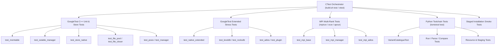

# LSMIO Test Subsystem Guide

The LSMIO test subsystem provides automated verification spanning C++ unit tests, extended storage stress tests, MPI multi-rank integration tests, and Python toolchain test suites.

For top-level architecture and subsystem navigation, refer to the [LSMIO Architecture Guide](../README.md).  
For benchmark execution and CLI flag options, see the [Benchmark Guide](../benchmark/README.md).  
For cluster orchestration and parsing tools, see the [Tools & Orchestration Guide](../tools/README.md).

---

## 1. Test Architecture & Frameworks

The testing harness combines CMake CTest orchestration with GoogleTest and Python `unittest`:



### 1.1 CTest Orchestration
- Managed via CMake in `test/CMakeLists.txt`.
- Supports multi-core parallel test execution (`ctest -j8`).
- Injects required runtime environments per test:
  - `LD_LIBRARY_PATH`: Points to `build/lib` for dynamic shared libraries.
  - `ADIOS2_PLUGIN_PATH`: Directs ADIOS2 tests to `build/lib` for plugin discovery.
  - `PYTHONPATH`: Adds `tools/` for `lsmiotool` test modules.
  - `LSMIO_ENV=DEV`: Configures fake scheduler/worker paths for Python integration tests.

### 1.2 GoogleTest C++ Framework
- Defined using `add_lsmio_base_test`, `add_lsmio_store_test`, and `add_lsmio_mpi_test` CMake functions.
- MPI tests are registered using `gtest_discover_tests` with an auto-detected MPI launcher (`mpirun`, `aprun`, `likwid-mpirun`, or `srun`).

### 1.3 Python `unittest` Suite
- Python tests in `tools/lsmiotool/test/` are discovered dynamically via `_discoverTestModuleNames()`.
- Each test module is registered as a discrete CTest target (e.g., `lsmiotool.main.VariantCatalogueTest`) for fine-grained execution and status reporting.

---

## 2. Test Execution Commands

All tests should be run through `./build.sh` or `ctest`.

### 2.1 Standard Test Execution

```bash
# Compile and run default test suite
./build.sh test

# Or run directly from the build directory in parallel
cd build && ctest -j8 --output-on-failure
```

### 2.2 Extended Full Test Suite (`xtest`)

```bash
# Runs all 134+ C++, MPI, Python, and Staging tests with 120s timeout
./build.sh xtest
```

### 2.3 Python Toolchain Suite (`ptest`)

```bash
# Runs all lsmiotool unit, functional, and integration tests
./build.sh ptest

# Equivalent direct execution
cd tools/lsmiotool && ./lsmiotool test
```

### 2.4 Targeted Execution via Regex Filtering

You can run specific test subsets using `ctest -R <regex>`:

```bash
# Run SSTableManager tests (including mmap and pread verification)
ctest -R "SSTableManagerTest" -V

# Run Native Store tests
ctest -R "lsmioNative" -V

# Run all MPI multi-rank tests
ctest -R "test_mpi_" -V

# Run all lsmiotool Python tests
ctest -R "lsmiotool\." -V

# Run the 35-variant catalogue validation test
ctest -R "lsmiotool\.main\.VariantCatalogueTest" -V

# Run staging and installed smoke tests
ctest -R "lsmiotool_staged|lsmiotool_installed_smoke" -V
```

### 2.5 Recommended Local Filesystem Mount Options

When running extensive regression testing on a dedicated local HDD, update mount options to disable access time updates and metadata bottlenecks:

```bash
mount -o noatime,nodiratime /dev/sda2 /media/400GB
```

---

## 3. Test Suite Breakdown & Fixtures

### 3.1 Store Unit Tests

| Test Executable | Source File | Key Verification Scope |
| :--- | :--- | :--- |
| `test_memtable` | `test/test_memtable.cpp` | Validates in-memory memtable structures: `VectorNoSort`, `VectorSort`, `Map` (`std::map`), and `BTree` (`tlx::btree_map`). Asserts entry ordering, insertion speed, and capacity bounds. |
| `test_sstable_manager` | `test/test_sstable_manager.cpp` | Validates SSTable creation, Dense Index Footer generation, binary search offsets, and high-performance read paths: `mmap` zero-copy extraction, persistent `pread()` speculative buffering, and fallback stream I/O. |
| `test_native` | `test/test_native.cpp` | Validates `LSMIOStoreNative` core engine operations: `put`, `get`, `scan`, range queries, and memtable background flushes. |
| `test_file_pool` | `test/test_file_pool.cpp` | Validates background file pre-allocation pool (`FilePool`), descriptor rotation, and capacity limits. |
| `test_file_closer` | `test/test_file_closer.cpp` | Validates asynchronous deferred file close thread pool (`FileCloser`) ensuring zero file descriptor leaks. |
| `test_posix` | `test/test_posix.cpp` | Validates POSIX direct I/O abstractions, error handling, and directory traversal utilities. |
| `test_manager` | `test/test_manager.cpp` | Validates the top-level `LSMIOManager` abstraction coordinating multi-rank partition hierarchies. |

### 3.2 Extended Stress & Backend Tests

| Test Executable | Source File | Key Verification Scope |
| :--- | :--- | :--- |
| `test_native_extended` | `test/test_native_extended.cpp` | Long-running multi-iteration stress tests, large payload handling (>64 KiB), boundary key tests, and heavy concurrent write-read cycles. |
| `test_leveldb` | `test/test_leveldb.cpp` | Verifies LevelDB integration, lifecycle management, and comparative parity with native storage. |
| `test_rocksdb` | `test/test_rocksdb.cpp` | Verifies RocksDB integration, column families, and comparative parity with native storage. |
| `test_adios` | `test/test_adios.cpp` | Verifies ADIOS2 BP file operations, attribute handling, and step transitions. |
| `test_plugin` | `test/test_plugin.cpp` | Verifies the LSMIO ADIOS2 storage engine transport plugin. |
| `test_benchmark` | `test/test_benchmark.cpp` | Unit tests for synthetic workload generators, key permutation algorithms, and timer calculations in `BMBase`. |

### 3.3 MPI Multi-Rank Integration Tests

| Test Executable | Source File | Key Verification Scope |
| :--- | :--- | :--- |
| `test_mpi_base` | `test/test_mpi_base.cpp` | Multi-rank initialization, MPI barrier synchronization, collective vs. independent rank operations, and host grouping. |
| `test_mpi_manager` | `test/test_mpi_manager.cpp` | Multi-rank storage manager orchestration, verifying per-rank aggregation directories and isolated SSTable partitions. |
| `test_mpi_adios` | `test/test_mpi_adios.cpp` | Distributed multi-rank ADIOS2 I/O operations and plugin coordination across parallel MPI ranks. |

---

## 4. Debugging Protocols & Diagnostics

### 4.1 Debug Build Configuration

To compile LSMIO with debug symbols (`-g`) and without compiler optimizations:

```bash
# Reconfigure CMake in DEBUG mode
./build.sh debug make
```

### 4.2 Attaching GDB

To debug a crashing or failing unit test under GDB:

```bash
gdb --args ./build/test/test_sstable_manager --gtest_filter=SSTableManagerTest.*
```

Useful GDB breakpoints:
```text
(gdb) break SSTableManager::readValueAt
(gdb) break IndexNode::initReader
(gdb) run
(gdb) backtrace
```

### 4.3 Attaching LLDB (`xlldb`)

On systems using Clang/LLVM or macOS, attach LLDB to investigate test execution:

```bash
lldb ./build/test/test_sstable_manager -- --gtest_filter=SSTableManagerTest.*
```

Within LLDB:
```text
(lldb) breakpoint set --name readValueAt
(lldb) run
(lldb) bt
```

### 4.4 AddressSanitizer (ASan) & Memory Safety

To identify memory corruption, buffer overflows, or use-after-free conditions:

```bash
# Configure with AddressSanitizer and UndefinedBehaviorSanitizer
cmake -B build -DCMAKE_BUILD_TYPE=DEBUG -DCMAKE_CXX_FLAGS="-fsanitize=address,undefined -fno-omit-frame-pointer"
cmake --build build -j8
ctest --test-dir build -R "SSTableManagerTest" -V
```

### 4.5 Code Coverage Analysis

To measure test code coverage across C++ libraries and Python modules:

```bash
# Build with instrumentation and run tests
./build.sh coverage
```

- Linux/GCC generates an HTML coverage report using `lcov` at `build/coverage_report/index.html`.
- Python coverage for `lsmiotool` is generated at `build/lsmiotool-python-coverage.json`.
