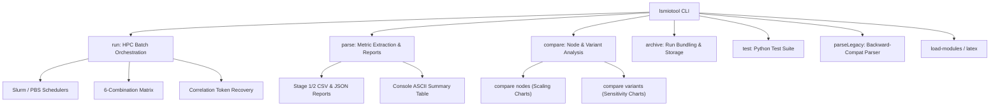

# LSMIO Toolchain Subsystem Guide

The LSMIO toolchain subsystem provides enterprise-grade benchmark run orchestration, cluster scheduler integration (Slurm and PBS), evidence extraction and reporting, and automated comparative visualization.

For top-level architecture and subsystem navigation, refer to the [LSMIO Architecture Guide](../README.md).  
For standalone benchmark binary execution and CLI options, see the [Benchmark Guide](../benchmark/README.md).  
For C++ and Python test verification, see the [Testing Guide](../test/README.md).

---

## 1. Toolchain Architecture

The primary entry point is `lsmiotool` (located at `tools/lsmiotool/lsmiotool` in source or `<prefix>/bin/lsmiotool` when installed).



### CLI Subcommands Summary

| Subcommand | Description |
| :--- | :--- |
| `run` | Orchestrates multi-node benchmark runs across HPC schedulers with preflight validation and crash recovery. |
| `parse` | Parses immutable run root artifacts, formats ASCII console summaries, and produces Stage 1/2 CSV/JSON reports. |
| `compare` | Generates comparative scaling and variant sensitivity plots using Matplotlib. |
| `archive` | Bundles and archives benchmark run directories for long-term comparative analysis. |
| `test` | Executes the internal Python test suite across unit, functional, and integration fixtures. |
| `parseLegacy` | Backward-compatible parser for legacy unstructured output hierarchies. |
| `load-modules` | Dynamically configures HPC cluster environment modules defined in `environments.json`. |
| `latex` | Generates LaTeX table and figure source snippets for academic publications. |

---

## 2. Benchmark Orchestration (`lsmiotool run`)

`lsmiotool run` provides declarative, resilient benchmark orchestration across HPC clusters with native support for Slurm and PBS schedulers.

### 2.1 CLI Syntax and Usage

```bash
lsmiotool run <benchmark> <scale> [--ssd] [--setup <name>]
```

For legacy migration compatibility, global `--ssd` / `-s` is also accepted:
```bash
lsmiotool --ssd run <benchmark> <scale> [--setup <name>]
```

#### Arguments & Options:
- `<benchmark>`: Benchmark suite to run. Supported values:
  - `ior`: IOR parallel I/O benchmark (default setup: `BASE`).
  - `lsmio`: LSMIO storage engine benchmark (default setup: `NATIVE-M`).
  - `lmp`: LAMMPS ReaxFF molecular dynamics benchmark (default setup: `LSMIO`).
- `<scale>`: Execution scale. Supported values:
  - `local`: 1 task on 1 node (1 task/node).
  - `bake`: 1, 2, 4, 8 tasks on 1, 2, 4, 8 nodes (1 task/node).
  - `small`: 1, 2, 4, 8, 16, 24, 32, 40, 48 tasks on 1 task/node.
  - `large`: 4, 8, 16, 32, 64, 128, 192, 256 tasks on 4 tasks/node.
    *(Note: `lmp large` is unsupported and is rejected atomically before any mutation.)*
- `--ssd`: Selects SSD storage class root. Default storage class is HDD.
- `--setup <name>`: Explicitly overrides the benchmark setup profile.
  - **Syntax rule**: `--setup <name>` must be specified as two separate arguments. Syntax `--setup=value` is strictly rejected.

#### Benchmark Setups:
- **IOR setups**: `BASE` (default), `HDF5`, `HDF5-C`, `COLLECTIVE`, `FSYNC`, `REVERSE`.
- **LSMIO setups**: `NATIVE-M` (default), `ADIOS-M`, `PLUGIN-M`, `ROCKSDB-M`, `LEVELDB-M`, `ADIOS`, `PLUGIN`, `ROCKSDB`, `LEVELDB`, `MANAGER`.
- **LMP setups**: `LSMIO` (default), `LSMIO-MMAP`, `FS`.

---

### 2.2 6-Combination Execution Matrix

Each submitted scheduler allocation executes exactly 6 stripe count and block size combinations in an immutable, fixed sequence:
1. `(16, 8M)` - 16 stripes, 8 MiB block size
2. `(16, 1M)` - 16 stripes, 1 MiB block size
3. `(16, 64K)` - 16 stripes, 64 KiB block size
4. `(4, 8M)` - 4 stripes, 8 MiB block size
5. `(4, 1M)` - 4 stripes, 1 MiB block size
6. `(4, 64K)` - 4 stripes, 64 KiB block size

On Lustre parallel filesystems, directories are explicitly configured using `lfs setstripe -c <stripes> -S <blocksize>` prior to executing each combination. Output and intermediate files are placed under isolated combination directories (`data/c<stripe>/b<block>/`).

---

### 2.3 Combination-Private Rank Claims, Logs, and Results

To guarantee isolation across ranks and execution combinations without state leakage:
- **Exclusive Rank Claims**: Each participating rank acquires an exclusive permanent claim lock file at `ranks/<global-rank>/<combination>/claim.lock` containing identity metadata (`run_id`, `point_id`, `rank`, `combination`). A collision on the same rank and combination has exactly one winner; claiming the same rank across different planned combinations is valid. Claims are permanent and never released.
- **Combination-Private Logs**: Rank execution logs are bound privately at `logs/<combination>/rank_<global-rank>.log`.
- **Combination-Private Results**: Terminal rank results are recorded at `ranks/<global-rank>/<combination>/result.json`, while combination controller results are stored at `combinations/<combination>/controller-result.json`.

---

### 2.4 Scale Points and Allocation Shapes

| Scale | Task Counts | Tasks Per Node (ppn) | Node Counts |
|:---|:---|:---|:---|
| `local` | `[1]` | 1 | 1 |
| `bake` | `[1, 2, 4, 8]` | 1 | 1, 2, 4, 8 |
| `small` | `[1, 2, 4, 8, 16, 24, 32, 40, 48]` | 1 | 1, 2, 4, 8, 16, 24, 32, 40, 48 |
| `large` | `[4, 8, 16, 32, 64, 128, 192, 256]` | 4 | 1, 2, 4, 8, 16, 32, 48, 64 |

---

### 2.5 LAMMPS (LMP) Upstream Assets, Task Tuning, Shared Argv & Large Scale Gate

LMP benchmark runs adhere strictly to upstream asset naming, tuning parameters, and argument structure:
- **Required Upstream Asset Files**:
  - `in.reaxc.hns` (input script)
  - `data.hns-equil` (initial molecular topology)
  - `ffield.reax.hns` (ReaxFF force field parameters)
  These assets are verified and staged from `share/lsmio/lmp-reaxff/` (installed) or `tools/bmtool/lmp-reaxff/` (source) without renamed aliases. SHA-256 hashes are verified during preflight and re-validated at combination staging.
- **Immutable Task Tuning**:
  Tuning parameters are derived exclusively from the immutable plan (`lmp_task_tuning`):

| Task Count | Replication Factor (`-v x/y/z`) | Buffer Size (`-lsmio-buf-size-mb`) |
|:---|:---|:---|
| 1 | 4 | 32 |
| 2 | 5 | 32 |
| 4 | 6 | 64 |
| 8 | 8 | 128 |
| 16 | 10 | 256 |
| 24 | 12 | 512 |
| 32 | 14 | 1024 |
| 40 | 15 | 1024 |
| 48 | 16 | 1024 |

- **Exact Shared Invocation Argv**:
  `lmp -in in.reaxc.hns -v x <REP> -v y <REP> -v z <REP>` followed by:
  - `LSMIO` setup: `-lsmio-buf-size-mb <BUF>`
  - `LSMIO-MMAP` setup: `-lsmio-mmap -lsmio-buf-size-mb <BUF>`
  - `FS` setup: `-lsmio-fallback`
  No Kokkos or dump flags are generated.
- **Atomic `lmp large` Gate**:
  `lmp large` is unsupported and is rejected atomically before run ID allocation, correlation token generation, capability probing, directory creation, filesystem mutation, or scheduler interaction.

---

### 2.6 Environment Profiles: Configured vs Certified

Environment configurations are loaded from `RUN_PROFILES` in `etc/environments.json`.
- **Supported profiles**:
  - `viking`: Slurm scheduler (`srun` launcher, `END,FAIL` mail, computed walltime)
  - `viking2`: Slurm scheduler (`srun` launcher, `END,FAIL` mail, pool configuration)
  - `archer2`: Slurm scheduler (`srun` launcher, `standard` partition/QoS)
  - `isambard`: PBS scheduler (`aprun` launcher, `abe` mail, fixed 6-hour walltime)
  - `dev`: Fake scheduler & launcher (test-only profile)
- **Certification status**: All production profiles are in `configured` state (pending opt-in live site certification). No external live certification is claimed.
- **Slurm Credentials**: Slurm profiles (`viking`, `viking2`, `archer2`) require valid `SB_ACCOUNT` and `SB_EMAIL` in the environment (`os.environ`), validated prior to run mutation. PBS (`isambard`) and DEV (`dev`) do not require or render Slurm credentials. Credentials are not stored in the immutable `manifest.json`.

---

### 2.7 Executable, Worker, and Capability Preflight Checks

Before allocating a run root or interacting with the scheduler:
- Benchmark executable and private worker are verified as regular readable/executable non-symlink files.
- Capability checks:
  - `ior`: Capability probed and verified via exact output inspection.
  - `lsmio`: Executables remain `configured` (unverified) because bare `-v` is not supported.
  - `lmp`: Verified via `-h` help inspection for `-lsmio-buf-size-mb` and setup flags (`-lsmio-mmap`, `-lsmio-fallback`).
  - LMP assets: Verified for existence, non-symlink status, and SHA-256 integrity.
- Failed preflight immediately halts execution without mutating the filesystem or falling back to PATH/CWD searching.

---

### 2.8 Scheduler Resource Directives & Policies

#### PBS Directives (Isambard Profile):
- Fixed walltime directive: `#PBS -l walltime=06:00:00`
- Typed mail mode directive: `#PBS -m abe` (abort, begin, end)
- Queue directive: `#PBS -q arm`
- Small / Bake / Local scale chunk directive: `#PBS -l select=<nodes>:ncpus=1:mpiprocs=1:mem=32GB` plus memory limits `#PBS -l pmem=8G` and `#PBS -l pvmem=8G`
- Large scale chunk directive: `#PBS -l select=<nodes>:ncpus=4:mpiprocs=4:mem=32GB` (without `pmem`/`pvmem`)
- Directives use node count per select chunk.
- No Slurm `#SBATCH` directives, accounts, or email credentials are required or rendered for PBS jobs.

#### Slurm Directives (Viking, Viking2, Archer2 Profiles):
- Computed walltime directive: `#SBATCH --time=...` (scaled with task count)
- Typed mail mode directive: `#SBATCH --mail-type=END,FAIL`
- Task distribution directive: `#SBATCH --distribution=cyclic:cyclic`
- Viking / Viking2 memory directive: `#SBATCH --mem=8gb`
- Archer2 partition & QoS directives: `#SBATCH -p standard`, `#SBATCH --qos=standard` (no memory directive)
- Standard directives for job name, ntasks, nodes, ntasks-per-node, output, error, account, and mail-user.

---

### 2.9 Decimal-Only Slurm Job IDs & Full Qualified PBS Handle Preservation

- **Slurm Handle Contract**: `sbatch --parsable` submit output is validated against regex `^[0-9]+$`. The single parsed decimal string is retained verbatim as `JobHandle.job_id`. Cluster-qualified output strings (e.g. `123;cluster`) are strictly rejected as unverified.
- **PBS Handle Contract**: PBS job IDs match regex `^[0-9]+(?:\.[A-Za-z0-9._-]+)?$`. The full qualified handle, including server suffix (e.g. `123456.isambard-pbs`), is preserved verbatim across queries, evidence, cancellation, and reporting.
- **Exact Query & Accounting Commands**:
  - Slurm active query: `squeue --noheader --jobs=<id> --format=%i|%T`
  - Slurm terminal accounting: `sacct --noheader --parsable2 --jobs=<id> --format=JobIDRaw,JobName,State,ExitCode`
  - Slurm cancel: `scancel <id>`
  - PBS active query: `qstat -F json <id>`
  - PBS terminal query: `qstat -F json -x <id>`
  - PBS cancel: `qdel <id>`

---

### 2.10 Finite Timeouts, Real Polling, and Fail-Closed Error Handling

- **Finite Command Timeouts**: Every scheduler interaction (submit, active query, accounting, cancel, recovery) uses a positive finite timeout derived from profile `grace_seconds` (default: 120s).
- **Monotonic Cancellation Deadline**: Cancellation and confirmation queries share a single monotonic deadline bounded by remaining grace time.
- **Real Foreground Polling**: Normal foreground execution polls the scheduler at 8-second intervals using real sleep (`time.sleep`).
- **Fail-Closed Error Handling**: Query failure, nonzero return code, unparseable payload, or command timeout immediately transitions execution to `INDETERMINATE` (fail closed; no 3-unknown retry loop, no fabricated terminal success, and no later points submitted).

---

### 2.11 Correlation Tokens, Pre-Spawn Dispatch Protocol & Crash Recovery

- **Correlation Token**: A 27-character identifier matching `^lm-[0-9a-f]{24}$` (prefix `lm-` followed by 24 lowercase hexadecimal characters) generated per scale point plan and transported exclusively as the scheduler job name.
- **4-Step Dispatch Protocol**:
  1. `submission_requested`: Written to point evidence before scheduler command argv preparation.
  2. `submission_dispatched`: Written immediately before spawning the scheduler process (contains exact planned argv, correlation token, and script/point correlation).
  3. `sbatch` / `qsub` process execution.
  4. `submission_recorded`: Persisted upon verifying the returned handle.
- **Accepted-Submit Crash Recovery**: If orchestration is interrupted after `submission_dispatched` before the job handle is persisted, the orchestrator queries the scheduler using the correlation token:
  - Slurm recovery: `squeue --noheader --name=<token> --format=%i|%j|%T` and `sacct --noheader --parsable2 --name=<token> --starttime=<manifest_utc> --format=JobIDRaw,JobName,State,ExitCode`
  - PBS recovery: `qstat -u <user> -F json` filtered by exact `Job_Name`.
  - Exactly 1 candidate job: Recovered and adopted without resubmission.
  - 0 or >1 candidate jobs: Marked `INDETERMINATE` without blind resubmission.

---

### 2.12 Run Root Allocation, Collision Refusal & Control Lock

- **Run Root Directory**: `<benchmark-root>/runs/<run-id>`
- **Collision Refusal**: `ArtifactStore.allocateRun(plan)` unconditionally performs exclusive directory creation (`os.mkdir` / `O_EXCL`). If the run root directory already exists, execution fails immediately with a nonzero return code before point preparation, scripts, or scheduler calls. Normal runs never adopt existing run roots.
- **Control Lock**: `control/lock` is an exclusive advisory lock (`fcntl.flock`) preventing concurrent orchestrators on the same run root.
- **Isolated Directory Layout**:
  - `manifest.json`: Canonical, immutable write-once run plan.
  - `control/lock`: Exclusive advisory lock file.
  - `control/events/<writer>/<sequence>.json`: High-level lifecycle events.
  - `scheduler/submission*.json` & `scheduler/observations/<writer>/<sequence>.json`: Point-private scheduler submissions and observations.
  - `worker/events/<sequence>.json`: Controller allocation execution records.
  - `combinations/<combination>/controller-result.json`: Combination execution results.
  - `ranks/<global-rank>/<combination>/claim.lock`: Exclusive permanent rank claim lock.
  - `ranks/<global-rank>/<combination>/result.json`: LSMIO rank worker results.
  - `logs/<combination>/rank_<global-rank>.log`: Rank stdout and stderr logs.
  - `data/c<stripe>/b<block>/`: Stripe/block combination data directories.
- **Disjoint Writer Ownership**: CONTROL, CONTROLLER, and RANK writers create only their owned evidence. External schedulers never write to the filesystem directly.
- **Authoritative State Precedence**:
  1. Specific independent execution failure (`FAILED`) outranks generic success.
  2. Confirmed requested cancellation (`CANCELLED`).
  3. Whole run success requires complete evidence across all points and combinations AND a durable `WHOLE_RUN_SUCCEEDED` control event (`SUCCEEDED`).
  4. Interruption recorded before the success marker permanently holds overall state at `INTERRUPTED` even if the final point succeeded.
  5. Conflicting handles, corrupt/missing evidence, unconfirmed cancellation, or missing terminal accounting yields `INDETERMINATE`.
  6. Stale active observations cannot regress terminal facts.

---

### 2.13 Signal Coordination & Interruption-First Durability

- SIGINT latches and exits with status code `130`.
- SIGTERM latches and exits with status code `143`.
- **Interruption-First Durability**: Upon receiving a signal, new submissions are immediately blocked, an interruption event is durably appended to the control stream before any cancellation command, the active job is cancelled via `scancel` / `qdel`, and cancellation is confirmed via bounded polling (poll interval: 8s, grace period: 120s).

---

### 2.14 Printed Identifiers and Paths

At startup and completion, `lsmiotool run` prints standardized identity lines to stdout:
- `Run ID: <run-id>`: Unique run identifier (e.g. `Run ID: run-20260821-120000-abcdef123456`)
- `Run Root: <path>`: Absolute path to the isolated run root directory
- `Point <point-id> Correlation Token: <token>`: Point token (e.g. `Point 00-tasks-1 Correlation Token: lm-abcdef0123456789abcdef01`)
- `Point <point-id> Job ID: <exact-id>`: Exact scheduler job handle (e.g. `Point 00-tasks-1 Job ID: 12345` or `Point 00-tasks-1 Job ID: 123456.isambard-pbs`)
- `Final State: <STATE>`: Final reconciled state (`SUCCEEDED`, `FAILED`, `INTERRUPTED`, `CANCELLED`, `INDETERMINATE`)
- `Exit Code: <n>`: Exit code (`0`, `1`, `130`, `143`)

Pre-plan validation errors print concise diagnostic messages to stderr only, without emitting fake identity lines on stdout.

---

### 2.15 Installed Layout vs Source Layout

The runtime paths are explicitly constructed without cross-fallback or directory searching:
- **Installed Layout**:
  - Public CLI: `<prefix>/bin/lsmiotool`
  - Private Worker: `<prefix>/libexec/lsmio/lsmiotool-worker`
  - Python Package: `<prefix>/share/lsmio/python/`
  - Profiles: `<prefix>/share/lsmio/etc/environments.json`
  - Version: `<prefix>/share/lsmio/VERSION`
  - LAMMPS ReaxFF Assets: `<prefix>/share/lsmio/lmp-reaxff/`
- **Source Layout**:
  - Public CLI: `tools/lsmiotool/lsmiotool`
  - Private Worker: `tools/lsmiotool/lsmiotool-worker`
  - Python Package: `tools/lsmiotool/`
  - Profiles: `tools/lsmiotool/etc/environments.json`
  - Version: `VERSION`
  - Assets: `tools/bmtool/lmp-reaxff/`

---

### 2.16 ParseLegacy Command Boundary & Limitations

- `lsmiotool parseLegacy` operates on legacy outputs and does not perform automatic run-root discovery or date/benchmark guessing.
- Internal `RunRootResolver` requires an explicit path to a directory containing a reconciled `manifest.json` and succeeded evidence.
- Legacy `parseLegacy` functionality remains backward-compatible and unchanged.

---

### 2.17 Migration Incompatibilities from Legacy `bmtool`

| Legacy `bmtool` Behavior | Modern `lsmiotool run` Implementation |
|:---|:---|
| Invocation via `tools/bmtool/bmtool run` | Invocation via `lsmiotool run <benchmark> <scale>` |
| Shared mutable paths (`$HOME/scratch/benchmark/data/*`) | Isolated private run roots (`<root>/runs/<run-id>`) |
| Uncoordinated `dirs-cleanup.sh` wiping data | Isolated per-combination data directories (`data/c<stripe>/b<block>`) |
| Same-day run directory collisions and overwrites | Unique immutable run IDs with collision-proof directory creation (`allocateRun`) |
| Whole-user queue polling (`squeue -u $USER` / `qstat -u $USER`) | Exact job ID tracking with correlation tokens (`lm-...`) |
| Status masking and hidden benchmark failures | Failure-preserving process runner and deterministic state reconciliation |
| Benchmark setups edited via shell variables | Explicit `--setup <name>` option (`--setup=value` rejected) |
| Unchecked CLI arguments silently ignored | Strict argument parsing; unknown options and misplaced arguments rejected |

---

## 3. Benchmark Run Parsing & Reporting (`lsmiotool parse`)

`lsmiotool parse` extracts performance metrics from modern benchmark run artifacts, formats an ASCII summary table for the console, and generates Stage 1 intermediate and Stage 2 master CSV or JSON reports.

### 3.1 CLI Syntax and Usage

```bash
lsmiotool parse <target> [--output-dir <dir>] [--format <csv|json>]
```

#### Arguments & Target Resolution:
- `<target>`: The benchmark target to parse. Supported target types:
  - **Run root directory**: Explicit path to an isolated run root directory (e.g., `<benchmark_root>/runs/<run_id>`).
  - **Manifest file**: Explicit path to a run manifest file (e.g., `<benchmark_root>/runs/<run_id>/manifest.json`).
  - **Benchmark name**: Short name (`ior`, `lsmio`, `lmp`). Scans candidate benchmark directories (e.g., `~/scratch/benchmark/<name>/runs/`) and infers the latest succeeded run directory containing a valid `manifest.json`.

#### Options:
- `--output-dir <dir>`: Destination directory for generated report files. Defaults to current working directory (`os.getcwd()`).
- `--format <format>`: Output report format (`csv` or `json`). Defaults to `csv`.

---

### 3.2 Report Schemas

`lsmiotool parse` generates structured performance reports matching legacy benchmark report schemas:

#### Stage 1 Intermediate CSV Report (LSMIO Only):
- File pattern: `agg-<stripe_count>-<stripe_size>-report.csv` (e.g., `agg-16-8M-report.csv`, `agg-4-64K-report.csv`).
- Schema (9 columns):
  ```csv
  access,bw(MiB/s),Latency(ms),block(KiB),xfer(KiB),iter,max(MiB/s),min(MiB/s),mean(MiB/s)
  ```

#### Stage 2 Master Reports:
- **IOR Master Report** (`ior-report.csv` / `ior-report.json`):
  Schema (30 columns):
  ```csv
  NodeCount,StripeCount,BlockSize,Operation,Max(MiB),Min(MiB),Mean(MiB),StdDev,Max(OPs),Min(OPs),Mean(OPs),StdDev,Mean(s),Stonewall(s),Stonewall(MiB),Test#,#Tasks,tPN,reps,fPP,reord,reordoff,reordrand,seed,segcnt,blksiz,xsize,aggs(MiB),API,RefNum
  ```
- **LSMIO Master Report** (`lsm-report.csv` / `lsm-report.json`):
  Schema (12 columns):
  ```csv
  NodeCount,StripeCount,BlockSize,Operation,bw,latency,block_kib,xfer_kib,iter,max_iter_bw,min_iter_bw,mean_iter_bw
  ```
- **LAMMPS Master Report** (`lmp-report.csv` / `lmp-report.json`):
  Schema (4 columns):
  ```csv
  NodeCount,StripeCount,BlockSize,throughput
  ```

---

### 3.3 Console Summary Output

Upon metric extraction, `lsmiotool parse` prints an aligned ASCII summary table to standard output displaying aggregated performance metrics across all scale points and combinations:

```text
+-----------+--------------------+-------------+-------------+-----------+-----------------+----------+----------+
| Benchmark | Point ID           | Tasks/Cores | Combination | Operation | Throughput MB/s | IOPS     | Duration |
+-----------+--------------------+-------------+-------------+-----------+-----------------+----------+----------+
| LSMIO     | 00-tasks-1-nodes-1 | 1           | 16-8M       | write     |         1245.50 |   155.69 |    10.20 |
| LSMIO     | 00-tasks-1-nodes-1 | 1           | 16-8M       | read      |         2130.10 |   266.26 |     5.80 |
| LSMIO     | 00-tasks-1-nodes-1 | 1           | 16-1M       | write     |          980.20 |   980.20 |    12.40 |
...
+-----------+--------------------+-------------+-------------+-----------+-----------------+----------+----------+
```

---

### 3.4 Exit Codes

`lsmiotool parse` returns strict, deterministic integer exit codes:

| Exit Code | Classification | Description |
|:---|:---|:---|
| `0` | Success | Run parsed successfully, reports generated, summary table printed. |
| `1` | General Error | General runtime error or unexpected configuration exception. |
| `2` | Invalid CLI Arguments | Invalid CLI syntax, missing target argument, unknown option flag, or invalid format value. |
| `3` | Missing Run Artifacts | Run root directory or `manifest.json` does not exist or is inaccessible. |
| `4` | Corrupted / Incomplete State | State reconciliation failed, missing required evidence, or run state is not `SUCCEEDED`. |
| `5` | Extraction Error | Log files missing, corrupted, malformed, or metric extraction failed. |

---

### 3.5 Distinction from `parseLegacy`

- **`lsmiotool parse` (Modern)**: Operates strictly read-only on immutable run roots generated by `lsmiotool run`. Validates `manifest.json`, enforces state reconciliation, extracts metrics across structured per-rank and controller logs using numerically stable floating-point summation (`math.fsum`), and outputs Stage 1/2 CSV and JSON reports alongside formatted ASCII summary tables.
- **`lsmiotool parseLegacy` (Legacy)**: Targets raw directory hierarchies generated by legacy scripts. Does not perform automatic target inference, manifest validation, or state reconciliation. Maintained strictly for backward compatibility.

---

## 4. Comparative Analysis & Visualization (`lsmiotool compare`)

`lsmiotool compare` generates publication-quality performance visualization charts using Matplotlib.

### 4.1 Node Scaling Comparison (`lsmiotool compare nodes`)

Evaluates performance progression across node scaling configurations:

```bash
lsmiotool compare nodes <folder> <read|write> [<stripes>] [<blocksize>] [--output-dir <dir>]
```

#### Arguments & Options:
- `<folder>`: Benchmark folder containing node subdirectories (e.g. `01`, `02`, `04`, `08`, ...).
- `<read|write>`: Required operation phase to compare (`read` or `write`).
- `[stripes]`: Stripe count: `4` or `16` (default: `4`).
- `[blocksize]`: Block size: `'64K'`, `'1M'`, or `'8M'` (default: `'1M'`).
- `--output-dir <dir>`: Destination directory for generated PNG plots (default: current working directory).

---

### 4.2 Variant Sensitivity Comparison (`lsmiotool compare variants`)

Evaluates sensitivity across storage engine parameters and tuning variants on fixed 8-node baseline runs:

```bash
lsmiotool compare variants <archive_folder> [read|write|both] [<stripes>] [<blocksize>] [--all] [--output-dir <dir>]
```

#### Arguments & Options:
- `<archive_folder>`: Archive folder containing `outputs-*` variant run subdirectories.
- `[operation]`: Operation to compare: `read`, `write`, or `both` (default: `both`).
- `[stripes]`: Stripe count: `4` or `16` (default: `4`).
- `[blocksize]`: Block size: `'64K'`, `'1M'`, or `'8M'` (default: `'1M'`).
- `--all`: Generate comparison charts across all 6 `(stripes, blocksize)` permutations.
- `--output-dir <dir>`: Destination directory for generated PNG plots (default: current working directory).

---

## 5. Benchmark Output Archiving (`lsmiotool archive`)

`lsmiotool archive` bundles, validates, and archives benchmark outputs for long-term preservation and cross-cluster comparative evaluations.

```bash
lsmiotool archive <benchmark> <scale> [<variant>] [--dest <path>]
```

- `<benchmark>`: Benchmark suite (`ior`, `lsmio`, or `lmp`).
- `<scale>`: Execution scale (`local`, `bake`, `small`, `large`, or `baseline`).
- `[variant]`: Variant identifier (mandatory for `baseline` scale; resolved against `VariantCatalogue`).
- `--dest <path>`: Destination archive directory.

---

## 6. Canonical 36-Variant Catalogue

The LSMIO toolchain maintains an authoritative catalog of 36 non-empty variants, synchronized across `lsmiotool` (`VariantCatalogue._VARIANT_SPECS` in Python) and legacy `bmtool` (`resolve_variant()` in POSIX shell).

| # | Variant Identifier | Correlation Tokens | CLI Engine Flags | Key Feature / Architecture Evaluated |
|:---|:---|:---|:---|:---|
| 1 | `footer` | `footer` | `--lsmio-footer-index` | Appends Dense Index Footer to SSTables for fast binary search. |
| 2 | `btree` | `btree` | `--lsmio-memtable btree` | Replaces unordered vector with cache-conscious B-tree memtable. |
| 3 | `footer-btree` | `footer-btree` | `--lsmio-footer-index --lsmio-memtable btree` | Dense Index Footer combined with B-tree memtable. |
| 4 | `map` | `map` | `--lsmio-memtable map` | Standard red-black tree (`std::map`) memtable. |
| 5 | `vsort` | `vsort` | `--lsmio-memtable vector-sort` | Sorted contiguous vector memtable. |
| 6 | `prealloc` | `prealloc` | `--lsmio-prealloc` | Pre-allocates SSTable files via `posix_fallocate()`. |
| 7 | `footer-prealloc` | `footer-prealloc` | `--lsmio-footer-index --lsmio-prealloc` | Dense Index Footer with disk file pre-allocation. |
| 8 | `manoff` | `manoff` | `--lsmio-manual-offset` | Manually tracks write byte offsets to eliminate `tellp()` syscalls. |
| 9 | `footer-manoff` | `footer-manoff` | `--lsmio-footer-index --lsmio-manual-offset` | Dense Index Footer with manual byte offset tracking. |
| 10 | `wbuf-512m` | `wbuf-512m` | `--lsmio-wbuffer 536870912` | Expands write buffer size to 512 MiB. |
| 11 | `wbuf-32m` | `wbuf-32m` | `--lsmio-wbuffer 33554432` | Shrinks write buffer size to 32 MiB. |
| 12 | `footer-wbuf-512m` | `footer-wbuf-512m` | `--lsmio-footer-index --lsmio-wbuffer 536870912` | Dense Index Footer with 512 MiB write buffer. |
| 13 | `footer-btree-prealloc` | `footer-btree-prealloc` | `--lsmio-footer-index --lsmio-memtable btree --lsmio-prealloc` | Dense Index Footer, B-tree memtable, and file pre-allocation. |
| 14 | `bfilter` | `bfilter` | `--lsmio-bfilter` | Enables Bloom filter generation for fast negative lookups. |
| 15 | `wal` | `wal` | `--lsmio-wal` | Enables Write-Ahead Logging (WAL) for durability. |
| 16 | `mmap` | `mmap` | `--lsmio-mmap` | Zero-copy memory-mapped read path with Lustre read-ahead. |
| 17 | `pread` | `pread` | `--lsmio-pread` | Persistent descriptor speculative single-syscall `pread()`. |
| 18 | `footer-mmap` | `footer-mmap` | `--lsmio-footer-index --lsmio-mmap` | Dense Index Footer combined with zero-copy `mmap`. |
| 19 | `footer-pread` | `footer-pread` | `--lsmio-footer-index --lsmio-pread` | Dense Index Footer combined with persistent `pread()`. |
| 20 | `compress` | `compress` | `--lsmio-compress` | Enables record compression. |
| 21 | `sync` | `sync` | `--sync` | Enforces synchronous write-through I/O. |
| 22 | `pool-8` | `pool-8` | `--lsmio-pool 8` | Expands pre-allocated SSTable file pool size to 8 files. |
| 23 | `flush` | `flush` | `--lsmo-always-flush` | Immediate flush mode (disables deferred write batching). |
| 24 | `batch-2048` | `batch-2048` | `--lsmio-batch-size 2048` | Expands deferred write batch threshold to 2048 entries. |
| 25 | `manoff-prealloc` | `manoff-prealloc` | `--lsmio-manual-offset --lsmio-prealloc` | Manual offset tracking combined with file pre-allocation. |
| 26 | `wbuf-512m-manoff-prealloc` | `wbuf-512m-manoff-prealloc` | `--lsmio-wbuffer 536870912 --lsmio-manual-offset --lsmio-prealloc` | 512 MiB write buffer, manual offsets, and pre-allocation. |
| 27 | `footer-wbuf-32m` | `footer-wbuf-32m` | `--lsmio-footer-index --lsmio-wbuffer 33554432` | Dense Index Footer with 32 MiB write buffer. |
| 28 | `footer-pool-8` | `footer-pool-8` | `--lsmio-footer-index --lsmio-pool 8` | Dense Index Footer with 8-file pre-allocation pool. |
| 29 | `footer-wbuf-512m-manoff-prealloc` | `footer-wbuf-512m-manoff-prealloc` | `--lsmio-footer-index --lsmio-wbuffer 536870912 --lsmio-manual-offset --lsmio-prealloc` | Footer, 512 MiB buffer, manual offsets, and pre-allocation. |
| 30 | `footer-vsort-manoff-prealloc` | `footer-vsort-manoff-prealloc` | `--lsmio-footer-index --lsmio-memtable vector-sort --lsmio-manual-offset --lsmio-prealloc` | Footer, sorted vector memtable, manual offsets, pre-allocation. |
| 31 | `footer-vsort-manoff-mmap` | `footer-vsort-manoff-mmap` | `--lsmio-footer-index --lsmio-memtable vector-sort --lsmio-manual-offset --lsmio-mmap` | Dense Index Footer, sorted vector memtable, manual offsets, memory-mapped reads. |
| 32 | `footer-vsort-manoff` | `footer-vsort-manoff` | `--lsmio-footer-index --lsmio-memtable vector-sort --lsmio-manual-offset` | Dense Index Footer, sorted vector memtable, manual offsets. |
| 33 | `footer-pool-8-mmap` | `footer-pool-8-mmap` | `--lsmio-footer-index --lsmio-pool 8 --lsmio-mmap` | Dense Index Footer, 8-file pre-allocation pool, memory-mapped reads. |
| 34 | `footer-manoff-pool-8-mmap` | `footer-manoff-pool-8-mmap` | `--lsmio-footer-index --lsmio-manual-offset --lsmio-pool 8 --lsmio-mmap` | Dense Index Footer, manual offsets, 8-file pre-allocation pool, memory-mapped reads. |
| 35 | `footer-btree-manoff-mmap` | `footer-btree-manoff-mmap` | `--lsmio-footer-index --lsmio-memtable btree --lsmio-manual-offset --lsmio-mmap` | Dense Index Footer, B-tree memtable, manual offsets, memory-mapped reads. |
| 36 | `footer-manoff-pool-8` | `footer-manoff-pool-8` | `--lsmio-footer-index --lsmio-manual-offset --lsmio-pool 8` | Dense Index Footer, manual offsets, 8-file pre-allocation pool. |

> [!NOTE]
> In addition to the 36 non-empty variants above, the empty baseline variant (`base` or `default`) uses standard defaults (128MB write buffer, `vector-no-sort` memtable, and no extra flags).
>
> **Buffer Sizing Standard**: In accordance with experimental rigor, read-path optimization variants (`pread`, `mmap`, `footer-pread`, `footer-mmap`) standardly use the 128MB write buffer size matching the ADIOS2 baseline. Variants combining 512MB write buffers with read optimizations are intentionally omitted to avoid confounding buffer capacity with read-path efficiency.
